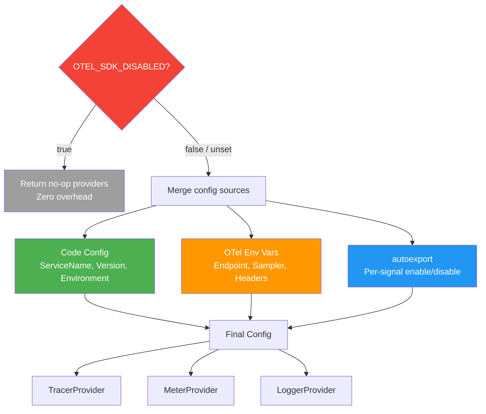

# Configuration Strategy

## Context

We need to decide how services configure the telemetry library. This affects how easy it is to
enable/disable signals, change endpoints, and control sampling without redeploying.

---

## Three Configuration Methods

### 1. Library defaults (Programmatic)

```go
telemetry.Init(ctx)
```

| Pros | Cons |
|------|------|
| Type-safe, IDE autocomplete | Requires redeploy to change |
| Explicit, easy to understand | Can't toggle per-environment |

### 2. Environment Variables (OTel Standard)

```bash
SERVICE_NAME=my-service
CODE_VERSION=1.0.0
ENVIRONMENT=production
OTEL_EXPORTER_OTLP_ENDPOINT=http://localhost:4318
OTEL_TRACES_SAMPLER=parentbased_traceidratio
OTEL_TRACES_SAMPLER_ARG=0.5
```

| Pros | Cons |
|------|------|
| Industry standard | Not all env vars work in Go (see gaps below) |
| Change without redeploying | No type safety |
| 12-factor compliant | More env vars to manage |

### 3. File-Based (YAML)

```yaml
file_format: "1.0"
disabled: ${OTEL_SDK_DISABLED}
tracer_provider:
  processors:
    - batch:
        exporter:
          otlp:
            endpoint: http://localhost:4318
```

| Pros | Cons |
|------|------|
| Single source of truth | Go requires `otelconf` contrib — NOT zero-code |
| Env var substitution inside YAML | File management in containers adds complexity |
| Matches Java's approach | Overrides ALL other env vars |

### File-Based Config: Language Support

| Language | Support | Zero-Code? |
|----------|---------|------------|
| **Java** | ✅ Full | ✅ Yes — Java agent handles everything |
| **Go** | ⚠️ Via contrib | ❌ No — must call `otelconf.NewSDK()` in code |
| .NET | ✅ Full | ✅ Yes |
| Python | ✅ Full | ✅ Yes |
| JavaScript | ✅ Full | ✅ Yes |

> **Go is the only major language without zero-code OTel.** You always write setup code.

---

## ⚠️ Go SDK Gaps

These standard OTel env vars are **NOT implemented** in Go's core SDK:

| Env Var | Spec Says | Go Reality |
|---------|-----------|------------|
| **`OTEL_SDK_DISABLED`** | Must create no-op SDK | ❌ **Not implemented** — only via `otelconf` YAML |
| `OTEL_TRACES_EXPORTER` | Select exporter or `none` to disable | ⚠️ Only works with `autoexport` contrib package |
| `OTEL_METRICS_EXPORTER` | Same | ⚠️ Same |
| `OTEL_LOGS_EXPORTER` | Same | ⚠️ Same |
| `OTEL_PROPAGATORS` | Select propagators | ⚠️ Only via `autoprop` contrib package |

**What this means:** If we hardcode `otlptracehttp.New(ctx)` in our lib, setting
`OTEL_TRACES_EXPORTER=none` does nothing. To respect these env vars, we must use the
`autoexport` contrib package instead.

### What DOES Work Automatically

The Go SDK does read these without extra packages:
- `SERVICE_NAME`, `OTEL_RESOURCE_ATTRIBUTES` — resource detection
- `OTEL_TRACES_SAMPLER`, `OTEL_TRACES_SAMPLER_ARG` — sampler config
- `OTEL_EXPORTER_OTLP_ENDPOINT`, `OTEL_EXPORTER_OTLP_HEADERS` — exporter target
- `OTEL_EXPORTER_OTLP_INSECURE` — TLS control
- `OTEL_BSP_*` — batch span processor tunables
- `OTEL_BLRP_*` — batch log processor tunables
- `OTEL_METRIC_EXPORT_INTERVAL` — metric export interval

### Precedence

`Init(ctx)` reads service identity from env vars and merges OTel resource attributes from
`OTEL_RESOURCE_ATTRIBUTES`.

---

## Our Options

### Option A: Pure Env Vars

```go
// Service code — zero config
shutdown, err := telemetry.Init(ctx)
```

```bash
# Everything in environment
SERVICE_NAME=payment-service
CODE_VERSION=1.2.0
ENVIRONMENT=production
OTEL_EXPORTER_OTLP_ENDPOINT=http://localhost:4318
OTEL_TRACES_EXPORTER=otlp
OTEL_METRICS_EXPORTER=none
```

### Option B: Library Defaults

```go
shutdown, err := telemetry.Init(ctx)
```

### Option C: Env + OTel Resource Attributes (Recommended)

Service identity and operational knobs via env vars.

```go
// Code — what identifies the service
shutdown, err := telemetry.Init(ctx)
```

```bash
# Env vars — operational, changeable without redeploy
OTEL_EXPORTER_OTLP_ENDPOINT=http://localhost:4318
OTEL_TRACES_SAMPLER=parentbased_traceidratio
OTEL_TRACES_SAMPLER_ARG=0.5
OTEL_METRICS_EXPORTER=none        # disable metrics for this service
OTEL_SDK_DISABLED=true            # kill switch (our lib handles this)
```



**What our lib adds that Go SDK doesn't:**
- `OTEL_SDK_DISABLED` support — we check it and return no-op providers
- Sensible defaults for our infra (localhost:4318, insecure=true)

---

## Kill Switch

Since Go doesn't implement `OTEL_SDK_DISABLED`, our lib handles it:

```go
func Init(ctx context.Context) (func(context.Context) error, error) {
    if os.Getenv("OTEL_SDK_DISABLED") == "true" {
        otel.SetTracerProvider(nooptrace.NewTracerProvider())
        otel.SetMeterProvider(noopmeter.NewMeterProvider())
        return func(context.Context) error { return nil }, nil
    }
    // Normal setup...
}
```

**Use cases:** collector outage, performance debugging, cost control in dev environments.

---

## Per-Signal Control

Services that don't need all signals can disable individually:

```bash
# Only traces, no metrics or logs
OTEL_TRACES_EXPORTER=otlp
OTEL_METRICS_EXPORTER=none
OTEL_LOGS_EXPORTER=none
```

This requires our lib to use the `autoexport` contrib package internally.
If we hardcode exporters, these env vars have no effect.

---

## Quick Reference

| What | Where | Why |
|------|-------|-----|
| Service name | Env var (`SERVICE_NAME`) | Tied to service identity |
| Service version | Env var (`CODE_VERSION`) | Tied to build |
| Environment | Env var (`ENVIRONMENT`) | Runtime deployment context |
| Collector endpoint | Env var (`OTEL_EXPORTER_OTLP_ENDPOINT`) | Infrastructure concern |
| Sampling ratio | Env var (`OTEL_TRACES_SAMPLER_ARG`) | Tunable per environment |
| Signal enable/disable | Env var (`OTEL_*_EXPORTER=none`) | Operational toggle |
| Kill switch | Env var (`OTEL_SDK_DISABLED=true`) | Emergency control |
| Extra attributes | Env var (`OTEL_RESOURCE_ATTRIBUTES`) | Per-deployment metadata |
| Instance id | Derived `hostname:SERVICE_PORT`, overridable via `OTEL_RESOURCE_ATTRIBUTES` or `Config.ServiceInstanceID` | One series per replica on the Prometheus side |

---

## Decision

> **TBD** — To be decided by the team.
