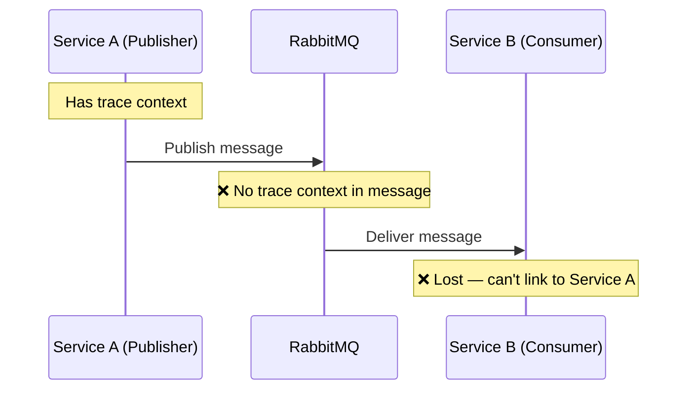
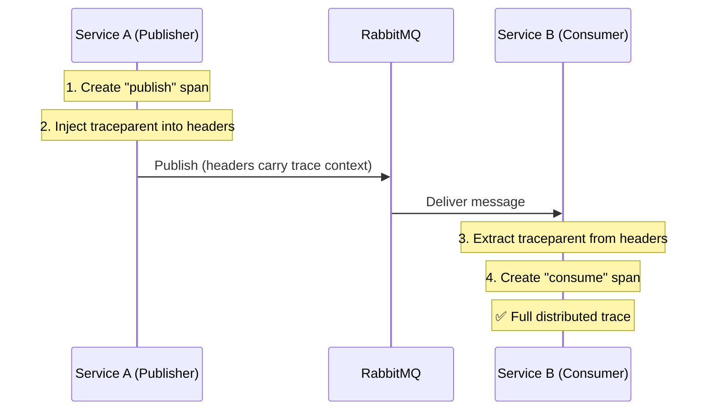
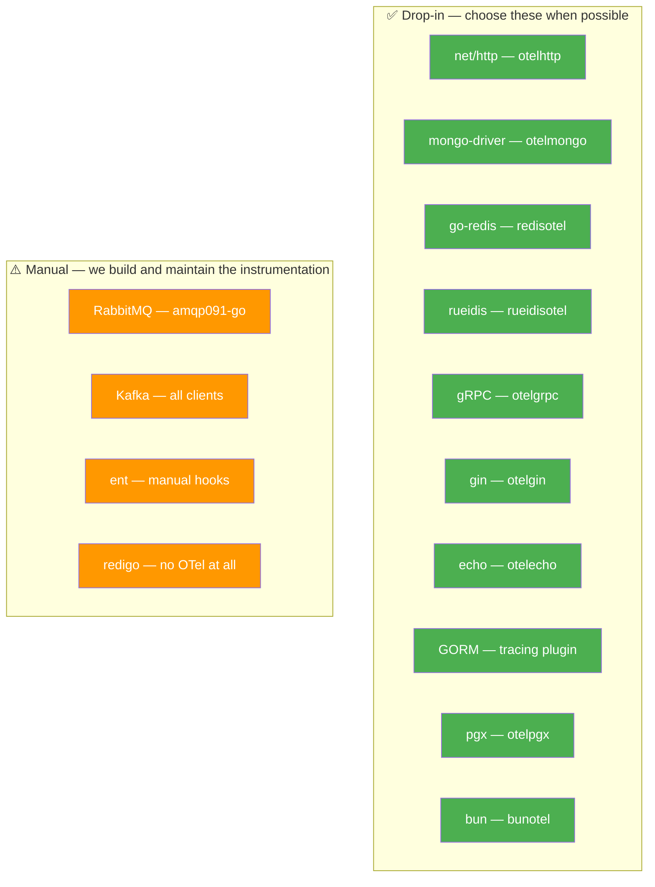

# Go Libraries & OTel Instrumentation

## What is OTel Instrumentation?

OTel instrumentation is the code that makes a client library (MongoDB driver, Redis client, etc.)
emit traces, metrics, and logs automatically. Depending on the library you choose, this can be
**drop-in** or require **manual implementation**.

### Instrumentation Categories

| Category | What it means | Maintained by | Effort |
|----------|--------------|---------------|--------|
| **Official OTel Contrib** | Lives in `go.opentelemetry.io/contrib`. Follows OTel release cycle. | OTel community | Drop-in, ~3 lines |
| **First-Party** | Built into the driver library itself. | Driver maintainers | Drop-in, ~3 lines |
| **Community** | Third-party package, not officially maintained. | Individual devs | Drop-in but riskier |
| **Manual** | No instrumentation exists. We create spans, propagate context ourselves. | Us | ~30-50 lines per operation |

**The library you choose determines the instrumentation effort.** Two Redis clients can have
completely different OTel stories — one drop-in, one manual. This is a key factor when choosing.

---

## MongoDB

| Library | Type | Stars | OTel Support | Instrumentation Effort |
|---------|------|-------|-------------|----------------------|
| **mongo-driver** | Official driver | ⭐ 8.5k | ✅ Official (otel-contrib) | Drop-in |
| mgm | ODM | ⭐ 764 | ⚙️ Indirect (inherits from driver) | Drop-in if driver is instrumented |
| qmgo | Wrapper | ⭐ 1.3k | ⚙️ Indirect (inherits from driver) | Drop-in if driver is instrumented |

**mongo-driver** is the only real driver — ORMs/wrappers all use it underneath.
Instrumentation hooks at the driver level, so any ODM on top benefits automatically.

```go
// mongo-driver + otelmongo
opts := options.Client().ApplyURI(uri).SetMonitor(otelmongo.NewMonitor())
client, _ := mongo.Connect(opts)
// ✅ Every Find, Insert, Update, Delete generates spans automatically
```

> **Consequence of choosing an ODM (mgm/qmgo):** OTel still works because it hooks at the
> driver level. But you depend on the ODM exposing the underlying `*mongo.Client` to attach
> the monitor. If the ODM hides the client constructor, you may need to fork or configure it.

---

## Redis

| Library | Type | Stars | OTel Support | Instrumentation Effort |
|---------|------|-------|-------------|----------------------|
| **go-redis** v9 | Client | ⭐ 22k | ✅ First-party (in-repo) | Drop-in |
| **rueidis** | High-perf client | ⭐ 2.9k | ✅ First-party (in-repo) | Drop-in |
| redigo | Client (legacy) | ⭐ 9.8k | ❌ None | Full manual |

**Two viable options with different tradeoffs:**

```go
// Option 1: go-redis — safe, massive community
rdb := redis.NewClient(&redis.Options{Addr: addr})
redisotel.InstrumentTracing(rdb)  // traces
redisotel.InstrumentMetrics(rdb)  // metrics (pool size, latency)
// ✅ Every Get, Set, Del, Pipeline generates spans
```

```go
// Option 2: rueidis — higher performance, client-side caching
client, _ := rueidisotel.NewClient(rueidis.ClientOption{InitAddress: []string{addr}})
// ✅ Traces + metrics (pool, cache hit/miss, command duration) out of the box
```

> **Consequence of choosing redigo:** No OTel instrumentation exists. Every Redis call would need
> manual span wrapping — dozens of lines per operation type, plus we maintain it forever.
> redigo is also slowing down in maintenance. **Avoid for new projects.**

---

## RabbitMQ

| Library | Type | Stars | OTel Support | Instrumentation Effort |
|---------|------|-------|-------------|----------------------|
| **amqp091-go** | Official driver | ⭐ 2k | ❌ None | Full manual |
| go-rabbitmq | Wrapper | ⭐ 2.1k | ❌ None | Full manual |

**No Go library for RabbitMQ has OTel instrumentation.** This is an ecosystem-wide gap — not a
limitation of a specific library. Regardless of which driver we choose, we write the instrumentation.

### What Manual Instrumentation Means

Without a library, traces break at service boundaries:



We fix this by injecting/extracting trace context via AMQP headers:



### Implementation (~50 lines total)

```go
// 1. Adapter: bridges AMQP headers ↔ OTel propagation
type AMQPCarrier struct{ Headers amqp091.Table }

func (c *AMQPCarrier) Get(key string) string {
    if val, ok := c.Headers[key]; ok { return fmt.Sprintf("%v", val) }
    return ""
}
func (c *AMQPCarrier) Set(key, val string) { c.Headers[key] = val }
func (c *AMQPCarrier) Keys() []string { /* return header keys */ }
```

```go
// 2. Publish — create span + inject context
func Publish(ctx context.Context, ch *amqp091.Channel, exchange, key string, body []byte) error {
    ctx, span := otel.Tracer("rabbitmq").Start(ctx, exchange+" publish",
        trace.WithSpanKind(trace.SpanKindProducer),
        trace.WithAttributes(semconv.MessagingSystem("rabbitmq")),
    )
    defer span.End()

    headers := amqp091.Table{}
    otel.GetTextMapPropagator().Inject(ctx, &AMQPCarrier{Headers: headers})
    return ch.PublishWithContext(ctx, exchange, key, false, false,
        amqp091.Publishing{Headers: headers, Body: body})
}
```

```go
// 3. Consume — extract context + create span
func Consume(msg amqp091.Delivery, handler func(ctx context.Context, body []byte) error) error {
    ctx := otel.GetTextMapPropagator().Extract(context.Background(),
        &AMQPCarrier{Headers: msg.Headers})

    ctx, span := otel.Tracer("rabbitmq").Start(ctx, msg.Exchange+" consume",
        trace.WithSpanKind(trace.SpanKindConsumer),
        trace.WithAttributes(semconv.MessagingSystem("rabbitmq")),
    )
    defer span.End()

    if err := handler(ctx, msg.Body); err != nil {
        span.RecordError(err)
        span.SetStatus(codes.Error, err.Error())
        return err
    }
    return nil
}
```

### Official vs Manual: What You Lose

| Feature | Drop-in (mongo, redis) | Manual (RabbitMQ) |
|---------|----------------------|-------------------|
| Automatic spans | ✅ Every operation | ❌ Only where we add code |
| Standard attributes | ✅ Full semantic conventions | ⚠️ We set them ourselves |
| Context propagation | ✅ Built-in | ⚠️ We inject/extract via headers |
| Error recording | ✅ Automatic | ⚠️ We call RecordError() |
| Maintenance burden | Low | Medium — we own the code |
| OTel version sync | Handled by library | We manage it |

---

## HTTP Frameworks

| Library | Type | Stars | OTel Support | OTel Package |
|---------|------|-------|-------------|--------------|
| **net/http** | stdlib | — | ✅ Official (otel-contrib) | `otelhttp.NewHandler()` / `otelhttp.NewTransport()` |
| **gin** | Framework | ⭐ 88k | ✅ Official (otel-contrib) | `otelgin.Middleware("service")` |
| **echo** | Framework | ⭐ 32k | ✅ Official (otel-contrib) | `otelecho.Middleware("service")` |
| **gorilla/mux** | Router | ⭐ ~20k | ✅ Official (otel-contrib) | `otelmux.Middleware("service")` |
| **chi** | Router | ⭐ 22k | ✅ Community | `otelchi.Middleware("service")` |
| **fiber** | Framework | ⭐ 39k | ✅ First-party | `otelfiber.Middleware()` |

All major HTTP frameworks have OTel support. The difference is **who maintains it:**

```go
// net/http — Official OTel contrib (safest choice)
mux.Handle("/api/users", otelhttp.NewHandler(handler, "GET /api/users"))

// gin — Also official OTel contrib
r.Use(otelgin.Middleware("service-name"))

// chi — Community maintained (rejected from otel-contrib, but works well)
r.Use(otelchi.Middleware("service-name"))
```

> **Consequence of choosing chi:** The OTel middleware (`otelchi`) is community-maintained, not
> official. It works well but could lag behind OTel releases. The OTel team explicitly rejected
> chi from contrib. For net/http, gin, echo — the OTel team maintains the middleware.

---

## SQL / PostgreSQL

| Library | Type | Stars | OTel Support | OTel Package |
|---------|------|-------|-------------|--------------|
| **database/sql** | stdlib | — | ✅ Community | `XSAM/otelsql` |
| **pgx** v5 | PostgreSQL driver | ⭐ 13.8k | ✅ Community | `exaring/otelpgx` |
| **GORM** | ORM | ⭐ 39.7k | ✅ First-party | `gorm.io/plugin/opentelemetry` |
| **bun** | SQL-first ORM | ⭐ 4.8k | ✅ First-party | `bunotel` (in-repo) |
| **sqlx** | SQL extension | ⭐ 17.6k | ⚙️ Indirect | Inherits via `otelsql` at driver level |
| **ent** | Code-gen ORM | ⭐ 17k | ⚠️ Manual hooks | `ent.Intercept()` — no OTel package |

```go
// pgx — community instrumentation via native Tracer interface
cfg.ConnConfig.Tracer = otelpgx.NewTracer()
pool, _ := pgxpool.NewWithConfig(ctx, cfg)

// GORM — first-party plugin
db.Use(tracing.NewPlugin())

// bun — first-party, built by Uptrace (OTel-native company)
db.AddQueryHook(bunotel.NewQueryHook(bunotel.WithDBName("mydb")))
```

> **Consequence of choosing ent:** OTel requires manual interceptor hooks — no drop-in package.
> **Consequence of choosing GORM or bun:** First-party OTel plugin, maintained by the ORM team.
> **Consequence of choosing pgx:** Community package but uses pgx's native `QueryTracer` interface
> — stable API surface, unlikely to break.

---

## gRPC

| Library | Type | Stars | OTel Support | OTel Package |
|---------|------|-------|-------------|--------------|
| **google.golang.org/grpc** | Official | ⭐ ~22k | ✅ Official (otel-contrib) | `otelgrpc` |

```go
// Server
server := grpc.NewServer(grpc.StatsHandler(otelgrpc.NewServerHandler()))
// Client
conn, _ := grpc.NewClient(addr, grpc.WithStatsHandler(otelgrpc.NewClientHandler()))
```

No alternatives needed — one driver, official OTel support.

---

## Kafka

| Library | Type | Stars | OTel Support | Instrumentation Effort |
|---------|------|-------|-------------|----------------------|
| **segmentio/kafka-go** | Pure-Go | ⭐ 8.5k | ❌ None | Full manual |
| **IBM/sarama** | Go client | ⭐ 12.4k | ⚠️ Example only | Semi-manual (interceptor example in repo) |
| **confluent-kafka-go** | CGO (librdkafka) | ⭐ 5.1k | ❌ None | Full manual |

> **Kafka is the biggest OTel gap in the Go ecosystem.** Same situation as RabbitMQ — no client
> has proper instrumentation. Manual span creation + header propagation required.
> sarama at least has example interceptor code in its repo to reference.

---

## Summary



## Decision Criteria

When choosing a library, prioritize:

1. **Official OTel contrib** — maintained by OTel community, version-locked to SDK
2. **First-party** — maintained by the library authors (go-redis, GORM, bun, rueidis)
3. **Community** — third-party packages (otelchi, otelpgx, otelsql)
4. **Manual** — last resort, we own the maintenance (RabbitMQ, Kafka)

> Libraries without OTel support should only be chosen if there's no viable alternative
> (e.g., RabbitMQ — amqp091-go is the only real Go driver).

## Decision

> **TBD** — To be decided by the team.
