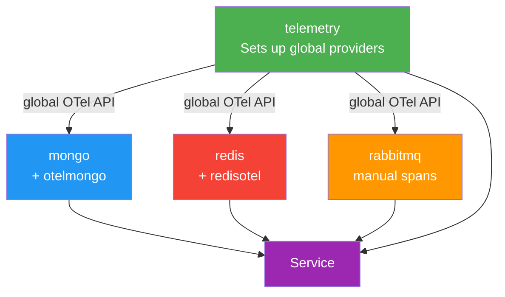
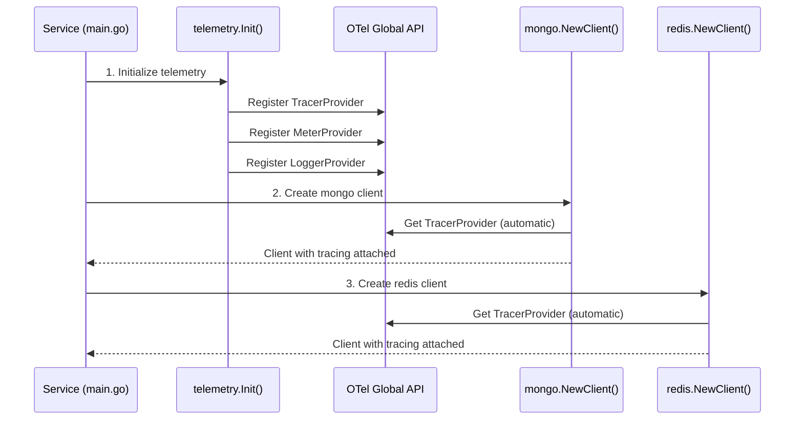
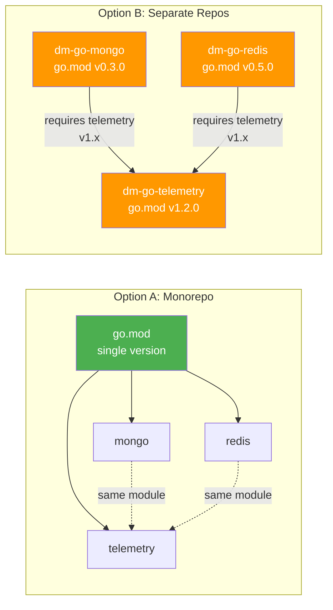

# Repo Strategy: Monorepo vs Separate Repos

## Context

We're replacing `dm-go` with a new set of standardized Go libraries for our microservices.
These libraries cover telemetry (OTel), database clients (MongoDB, Redis), messaging (RabbitMQ),
and HTTP utilities. We need to decide how to organize these packages across repositories.

## Options

### Option A: Monorepo (single repo, multiple packages)

```
dm-go-platform/
├── telemetry/     → OTel setup: traces, metrics, logs, middleware
├── mongo/         → Standardized MongoDB client + OTel instrumentation
├── redis/         → Standardized Redis client + OTel instrumentation
├── rabbitmq/      → Standardized RabbitMQ client + OTel instrumentation
├── httpkit/       → HTTP middleware, request/response helpers
└── logger/        → Structured logging
```

**Usage in services:**
```go
import (
    "github.com/delivery-much/dm-go-platform/telemetry"
    "github.com/delivery-much/dm-go-platform/mongo"
    // Only import what you need — unused packages are NOT downloaded or compiled
)
```

### Option B: Separate Repos (one repo per domain)

```
dm-go-telemetry    → OTel core
dm-go-mongo        → MongoDB patterns
dm-go-redis        → Redis patterns
dm-go-rabbitmq     → RabbitMQ patterns
dm-go-httpkit      → HTTP middleware/request
dm-go-logger       → Structured logging
```

**Usage in services:**
```go
import (
    telemetry "github.com/delivery-much/dm-go-telemetry"
    dmMongo "github.com/delivery-much/dm-go-mongo"
)
```

---

## Comparison

| Criteria                        | Monorepo                                         | Separate Repos                                 |
|---------------------------------|--------------------------------------------------|------------------------------------------------|
| **Dependency isolation**        | ✅ Go only downloads imported packages            | ✅ Fully isolated by design                     |
| **Cross-package imports**       | ✅ Same module, no version coordination           | ⚠️ Cross-repo deps need version pinning        |
| **Versioning**                  | ⚠️ One tag for all packages                      | ✅ Independent version per lib                  |
| **Breaking changes**            | ⚠️ Major bump affects entire module              | ✅ Scoped to the affected repo                  |
| **CI/CD**                       | ⚠️ All tests run on every PR                     | ✅ Only affected lib tests run                  |
| **Repo overhead**               | ✅ One repo, one CI config, one CODEOWNERS        | ⚠️ 6+ repos to maintain                        |
| **Discoverability**             | ✅ Everything in one place                        | ⚠️ Devs need to find/know each repo            |
| **PR workflow**                 | ✅ Cross-package changes in a single PR           | ⚠️ Coordinated PRs across repos                |
| **Onboarding**                  | ✅ Clone one repo, see everything                 | ⚠️ Need to find and clone multiple repos        |
| **Proven pattern**              | ✅ dm-go already works this way                   | ✅ Common in larger OSS ecosystems              |

---

## OTel Instrumentation Architecture

### How instrumentation works

The OpenTelemetry SDK separates concerns into two layers:

1. **Provider setup** (telemetry package) — initializes TracerProvider, MeterProvider, LoggerProvider
   and registers them globally via the OTel API.

2. **Client instrumentation** (mongo/redis/rabbitmq packages) — each client library hooks into the
   global providers to automatically emit traces, metrics, and logs for every operation.

### Available OTel instrumentation libraries

| Client Library        | OTel Instrumentation Package                                             | Type               |
|-----------------------|--------------------------------------------------------------------------|---------------------|
| `mongo-driver` v2    | `go.opentelemetry.io/contrib/instrumentation/go.mongodb.org/mongo-driver/mongo/otelmongo` | Official contrib   |
| `go-redis` v9        | `github.com/redis/go-redis/extra/redisotel/v9`                          | Built-in (by go-redis) |
| `amqp091-go`         | No official library — requires manual span creation                      | Manual              |

### How each package uses instrumentation

#### telemetry/
Sets up the global OTel providers. Knows nothing about specific clients.

```go
// Initializes TracerProvider, MeterProvider, LoggerProvider
// Exports middleware for net/http (via otelhttp)
// Services call telemetry.Init() once at startup
```

#### mongo/
Creates a standardized MongoDB client with tracing automatically attached.

```go
// Internally uses otelmongo.NewMonitor() as a client monitor
// Every Find, Insert, Update, Delete, Aggregate gets a span automatically
// Picks up the global TracerProvider — no explicit telemetry import needed
opts := options.Client().
    ApplyURI(uri).
    SetMonitor(otelmongo.NewMonitor())
```

#### redis/
Creates a standardized Redis client with tracing automatically attached.

```go
// Internally uses redisotel.InstrumentTracing() on the client
// Every Get, Set, Del, Pipeline operation gets a span automatically
rdb := redis.NewClient(&redis.Options{Addr: addr})
redisotel.InstrumentTracing(rdb)
redisotel.InstrumentMetrics(rdb) // optional: also emits metrics
```

#### rabbitmq/
Manual instrumentation since there's no official OTel library.

```go
// Requires manual span creation for Publish/Consume
// Propagates trace context via AMQP message headers
// Pattern: inject context on publish, extract on consume
```

### Dependency flow



**Key point:** mongo/redis/rabbitmq packages don't import `telemetry/` directly. They use the
global OTel API (`otel.GetTracerProvider()`), which telemetry has already configured at startup.

### Service startup flow



### Impact on repo strategy



**Monorepo:** All packages share one `go.mod`. OTel dependency versions are always in sync.
A single PR can update `otelmongo` alongside the core telemetry package.

**Separate repos:** Each lib has its own `go.mod` with independent OTel versions. You must ensure
`dm-go-mongo`'s OTel versions are compatible with `dm-go-telemetry`'s in every consuming service.
Manageable but requires coordination.

---

## Recommendation

**Monorepo** is the simpler choice for our team size and use case. It mirrors what `dm-go` already
does, avoids cross-repo version coordination, and keeps everything discoverable in one place.

The main tradeoff (shared versioning) is acceptable for an internal library where we control all
consumers. If a package needs a major bump, we bump the whole module — our services are the only
users, so the blast radius is contained.

---

## Decision

> **Monorepo.** The telemetry library was moved from the separate `dm-go-telemetry` repo into
> `dm-go` as the `telemetry` package (`github.com/delivery-much/dm-go/telemetry`), sharing the
> module's single `go.mod`.
